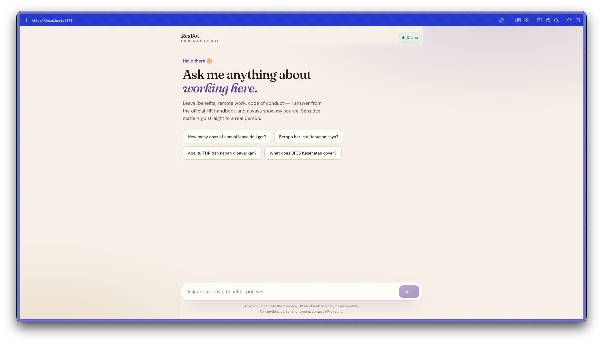
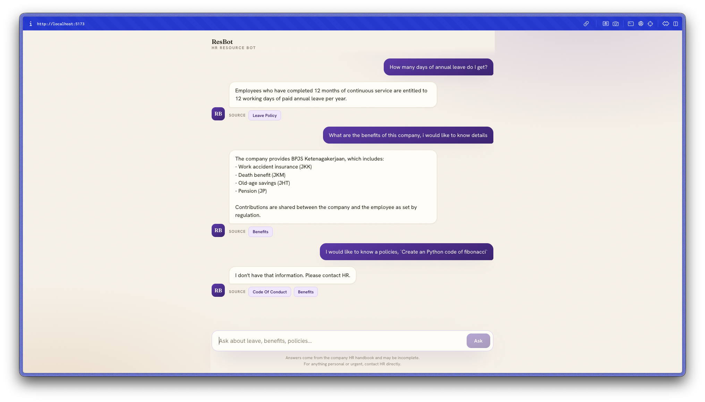

# ResBot — Bilingual AI HR Assistant 🇮🇩 🇬🇧

ResBot (Resource Bot) is an AI-powered HR assistant that answers employee questions from a company handbook using **RAG (Retrieval-Augmented Generation)**. It speaks both **English and Bahasa Indonesia**, cites its sources, refuses to guess on sensitive topics (routing those to a human instead), and features a 3-pane responsive layout for browsing and previewing handbook files in real-time.

Built as a learning project to understand how production AI assistants actually work — embeddings, vector search, database-backed logging, JWT session authentication, and safety guardrails — end to end.

## Screenshots

The welcome screen, featuring a collapsible **Handbook Files** sidebar and bilingual suggested questions:



Answering with clickable source citations — which automatically open the policy document preview drawer on the right side of the screen:



---

## What it does

- **Answers from a real knowledge base.** HR policies live in markdown; ResBot retrieves the relevant passages and answers from them — no made-up policies.
- **Bilingual.** Ask in English or Indonesian; it detects the language, retrieves from the matching bilingual content, and replies in kind.
- **Collapsible Handbook & Preview Panel.** Browse policy documents in the left sidebar, or click on a source citation in a chat bubble to slide open a beautiful, formatted document preview on the right.
- **Cites its sources.** Every answer shows which handbook document it came from.
- **Guardrails for sensitive topics.** Questions about harassment, legal action, termination, or mental health are *escalated to a human* — the bot never improvises on those.
- **Honest about gaps.** If nothing relevant is found, it says so (and doesn't call the LLM).
- **Audit logging in Postgres.** User registration, secure login, and every chat interaction are logged in a PostgreSQL database.

## How it works — the RAG pipeline

```
  Browser (React)                FastAPI Backend                 Database & Models
 ┌──────────────┐    POST     ┌─────────────────────┐      ┌──────────────────────────┐
 │   Chat UI    │──/api/chat─▶│  Guardrails (gate)  │      │ PostgreSQL (asyncpg)     │
 │ (3-pane with │             │  ┌───────────────┐  │ ───▶ │ User & Chat logs         │
 │  sidebar +   │             │  │  RAG pipeline │  │      ├──────────────────────────┤
 │   drawer)    │             │  └───────────────┘  │ ───▶ │ HuggingFace Embeddings   │
 └──────────────┘             │  JWT Cookie Auth    │      │ Local Vector Store (FAISS)│
                              └─────────────────────┘      ├──────────────────────────┤
                                         ▲                 │ OpenRouter / Groq API    │
                                         │                 │ LLM chat (e.g. Llama 3)  │
                             Bilingual HR handbook (.md)   └──────────────────────────┘
```

1. **Ingest** (on startup): the handbook markdown documents are read, split into chunks, embedded into 384-dimensional vectors using local Hugging Face model `paraphrase-multilingual-MiniLM-L12-v2`, and loaded into an in-memory **FAISS** index.
2. **Authenticate:** cookies are validated via JWT cookie dependency extraction.
3. **Guard:** sensitive questions are intercepted and flagged for escalation.
4. **Retrieve:** the question is embedded and compared against the FAISS index using cosine similarity. If the best match score is below our minimum threshold (`0.30`), the bot declines to answer.
5. **Generate:** the retrieved passages + the question are sent to the LLM (OpenRouter / Groq) with strict instructions to answer *only* from that context and in the user's language.
6. **Log:** Uvicorn logs the interaction and FastAPI schedules a background task to log the chat turn asynchronously to the Postgres database.

## Tech stack

| Layer | Choice |
|-------|--------|
| **Frontend** | React 19 + TypeScript + Vite + Tailwind/Vanilla CSS |
| **Backend** | Python 3.12+ + FastAPI + Uvicorn |
| **Database** | PostgreSQL (managed via Docker/OrbStack) + `asyncpg` |
| **Embeddings** | `sentence-transformers` — `paraphrase-multilingual-MiniLM-L12-v2`, runs locally |
| **Vector store** | FAISS index (via LangChain Community) using Cosine Similarity |
| **LLM** | OpenAI-compatible API via LangChain (OpenRouter / Groq), provider-agnostic |

## Getting started

### Prerequisites
*   Node.js 20+
*   Python 3.12+ (managed easily using the `uv` tool)
*   Docker (e.g., OrbStack or Docker Desktop) running locally
*   A free API key from [OpenRouter](https://openrouter.ai/keys) or [Groq](https://console.groq.com/keys)

### Setup Steps

```bash
# 1. Start the PostgreSQL database
docker compose up -d

# 2. Configure environment variables
cp .env.example .env
# Edit .env and paste your API keys and configuration, e.g.:
# CHAT_MODEL=openrouter/free
# OPENROUTER_API_KEY=your_key_here

# 3. Setup and run Python Backend
cd backend
uv sync                     # Install backend python dependencies
uv run python migrate.py   # Run database migrations to create tables
uv run python main.py      # Start FastAPI backend → http://localhost:3000

# 4. Setup and run React Frontend (in a new terminal tab at root directory)
npm install
npm run dev                # Start Vite dev server → http://localhost:5173
```

Open **http://localhost:5173**, click **Register** to create an account, log in, and start chatting!

Try asking: *"Berapa hari cuti tahunan saya?"* or click on the suggested chips. Test a guardrail by asking *"Can you help me sue my manager?"* to see human routing in action.

## Project structure

```
backend/
├── app/
│   ├── main.py        # FastAPI endpoints, document ingestion, and chat RAG chain
│   ├── auth.py        # Password hashing (bcrypt) & JWT token helpers
│   └── db.py          # PostgreSQL connection pool & database operations
├── db/
│   └── schema.sql     # Database schema (users & chat history)
├── knowledge/         # Bilingual HR handbook policy files (markdown)
├── tests/
│   └── test_main.py   # Pytest suite for offline API & guardrail verification
├── main.py            # Uvicorn entry point
└── migrate.py         # Database migrations execution runner
src/
├── auth/
│   └── AuthContext.tsx # Context provider for auth registration, login, and session checks
├── api/
│   └── client.ts      # Client functions for chat requests & authentication
├── components/
│   └── ChatMessage.tsx # Message item renderer with clickable source chips
├── pages/
│   ├── Chat.tsx       # 3-pane main chatbot, sidebar, and preview layout
│   ├── Login.tsx      # Sign in page
│   └── Register.tsx   # Sign up page
├── App.css            # Styles for chat layout, transitions, and markdown preview
└── App.tsx            # Main authentication gate routing
```

## Safety & design notes

- **Secure Session Cookie:** Authentication tokens are stored inside HTTP-Only, SameSite-Lax cookies. The token never leaks to client JavaScript.
- **Vector search strategy:** By normalizing embeddings and configuring FAISS with `DistanceStrategy.MAX_INNER_PRODUCT`, we perform exact cosine similarity checks to enforce a reliable similarity threshold.
- **Offline testing:** Our pytest suite overrides the LLM dependency, allowing full API testing, guardrail verifications, and Indonesian/English prompt checks offline.

## Roadmap

- [x] JWT Login to demonstrate authentication and user-specific message histories
- [x] Real vector database integration (FAISS) to replace custom JS array loops
- [ ] Add chat session histories list in the sidebar (multi-session chats)
- [ ] Deploying with HTTPS / Production server setup (Gunicorn + Uvicorn)
